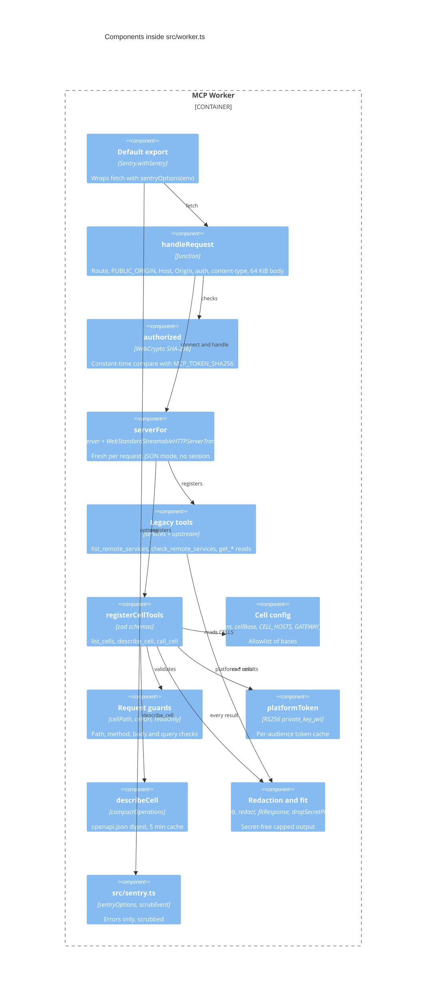

# 07 — C4 Component (MCP Worker)

```mermaid
C4Component
  title Components inside src/worker.ts
  Container_Boundary(w, "MCP Worker") {
    Component(entry, "Default export", "Sentry.withSentry", "Wraps fetch with sentryOptions(env)")
    Component(handle, "handleRequest", "function", "Route, PUBLIC_ORIGIN, Host, Origin, auth, content-type, 64 KiB body")
    Component(auth, "authorized", "WebCrypto SHA-256", "Constant-time compare with MCP_TOKEN_SHA256")
    Component(server, "serverFor", "McpServer + WebStandardStreamableHTTPServerTransport", "Fresh per request, JSON mode, no session")
    Component(legacyTools, "Legacy tools", "services + upstream", "list_remote_services, check_remote_services, get_* reads")
    Component(hubTools, "registerCellTools", "zod schemas", "list_cells, describe_cell, call_cell")
    Component(cellcfg, "Cell config", "cellsFrom, cellBase, CELL_HOSTS, GATEWAY_ROUTE", "Allowlist of bases")
    Component(guards, "Request guards", "cellPath, cellUrl, readOnly", "Path, method, body and query checks")
    Component(ptoken, "platformToken", "RS256 private_key_jwt", "Per-audience token cache")
    Component(describe, "describeCell", "compactOperations", "openapi.json digest, 5 min cache")
    Component(redaction, "Redaction and fit", "scrub, redact, fitResponse, dropSecretPrefix", "Secret-free capped output")
    Component(sentryopts, "src/sentry.ts", "sentryOptions, scrubEvent", "Errors only, scrubbed")
  }
  Rel(entry, handle, "fetch")
  Rel(entry, sentryopts, "options")
  Rel(handle, auth, "checks")
  Rel(handle, server, "connect and handle")
  Rel(server, legacyTools, "registers")
  Rel(server, hubTools, "registers")
  Rel(hubTools, cellcfg, "reads CELLS")
  Rel(hubTools, guards, "validates")
  Rel(hubTools, ptoken, "platform-* cells")
  Rel(hubTools, describe, "describe_cell")
  Rel(hubTools, redaction, "every result")
  Rel(legacyTools, redaction, "read results")
```

Sources: src/worker.ts, src/sentry.ts

## Open questions

- ไม่มี
